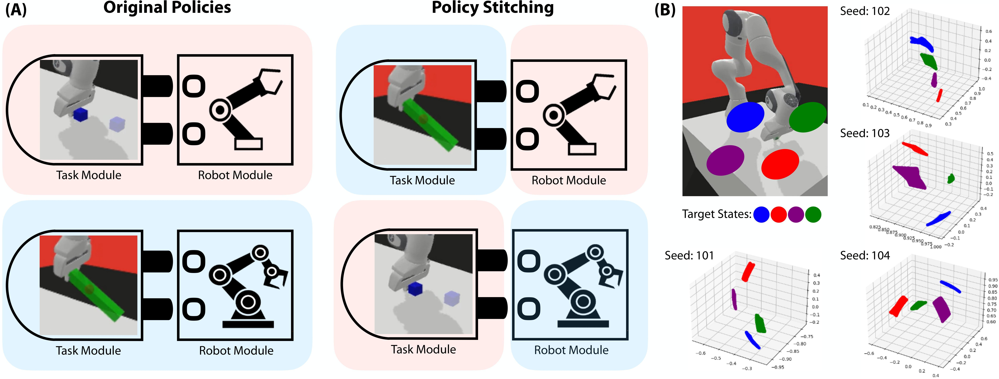
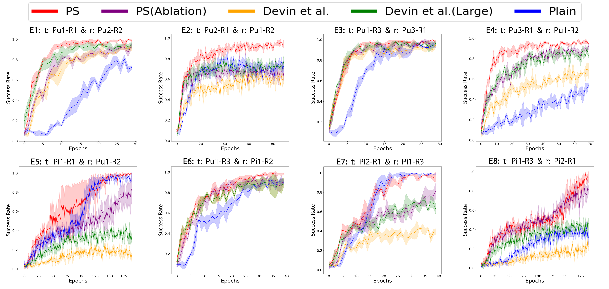
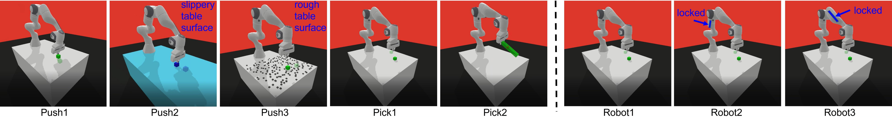

# Policy Stitching: Learning Transferable Robot Policies

[Pingcheng Jian](https://pingcheng-jian.github.io/),
[Easop Lee](https://www.linkedin.com/in/easoplee),
[Zachary Bell](https://www.linkedin.com/in/zachary-bell-976b55142),
[Michael M. Zavlanos](https://mems.duke.edu/faculty/michael-zavlanos),
[Boyuan Chen](http://boyuanchen.com/)
<br>
Duke University
<br>

[generalroboticslab.com/PolicyStitching](http://generalroboticslab.com/PolicyStitching/)


## Overview
This repo contains the implementation for paper *Policy Stitching: Learning Transferable Robot Policies*.


## Content

- [Installation](#installation)
- [Training](#training)
- [Testing](#testing)

## installation
- The development tools of this project can be installed with conda:
``` 
$ conda env create -f environment.yml .
```

## training
1. Train modular policy of the Panda Robot arm in simulation from scratch
```
mpirun -np 7 python -u module_sac_train_panda_PS.py --env-name='PandaPush-v2' --n-epochs=200 --device cuda:0 --seed 101 --save_data --save_model
```

2. Few-shot fine-tune the stitched policy of the Panda Robot arm in simulation
```
mpirun -np 7 python -u module_sac_train_panda_PS_few_shot.py --env-name='PandaL3Push-v2' --ro-env-name PandaL3Push-v3 --ta-env-name PandaPush-v2 --n-epochs=200 --device cuda:0 --seed 101 --save_data --save_model
```

3. Train modular policy of the UR5 Robot arm in simulation from scratch
```
mpirun -np 7 python -u module_sac_train_ur5_PS.py --env-name='Ur5Push1' --n-epochs=200 --device cuda:0 --seed 101 --control_type='joint' --save_data --save_model
```

4. Few-shot fine-tune the stitched policy of the UR5 Robot arm in simulation
```
mpirun -np 7 python -u module_sac_train_ur5_PS_few_shot.py --env-name='Ur5Push1' --ro-env-name Ur5Push4 --ta-env-name Ur5L5Push1 --n-epochs=200 --device cuda:0 --seed 101 --control_type='joint' --save_data --save_model
```

5. Few-shot fine-tune the stitched policy of the UR5 Robot arm in real world
```
mpirun -np 7 python -u module_sac_train_real_ur5_PS.py --env-name='Ur5Push1' --n-epochs=200 --device cuda:0 --seed 101 --control_type='joint' --save_data --save_model
```



## testing
1. test modular policy of the Panda Robot arm in simulation
```
python module_sac_test_panda_PS.py --device cpu --env-name PandaL3Push-v2 --ro-env-name PandaL3Push-v3 --ta-env-name PandaPush-v2 --ta_seed 101 --ro_seed 101
```

2. test modular policy of the UR5 Robot arm in simulation
```
python module_sac_test_ur5_PS.py --device cpu --env-name='Ur5Push1' --ro-env-name Ur5Push4 --ta-env-name Ur5L5Push1 --ta_seed 101 --ro_seed 101
```

3. test modular policy of the UR5 Robot arm in real world
```
python module_sac_test_real_ur5_PS.py --device cpu --env-name='Ur5Push1' --ro-env-name Ur5Push4 --ta-env-name Ur5L5Push1 --ta_seed 101 --ro_seed 101
```

Experiment setup for the Panda robot arm in the simulation


Experiment setup for the UR5 robot arm in the simulation and the real world


## Acknowledgement

This project refers to the github repositories [panda-gym](https://github.com/qgallouedec/panda-gym), 
[pybullet_ur5_robotiq](https://github.com/ElectronicElephant/pybullet_ur5_robotiq), and 
[hindsight-experience-replay](https://github.com/TianhongDai/hindsight-experience-replay).

